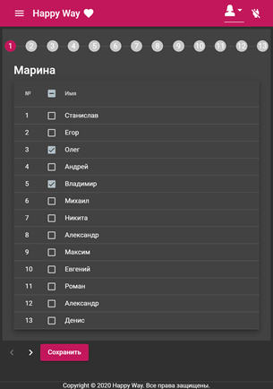
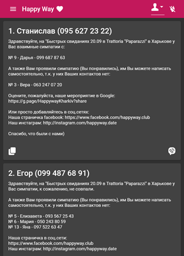

# HappyWayApp

SPA (Single Page Application) that helps to summarize results of the event. The event is speed dating for large numbers of new potential partners in a very short period of time. Main functionality of this application is result collection from sympathy cards and sending the results to event members.

## Used APIs, Frameworks and Libraries
  * ASP.NET Core 3.1 (Web API)
  * Entity Framework Core 3.1 with SQLite
  * Angular 10
  * Angular Material UI component library
  * Google Sheets API

## Event Members Page

 

## Results Page

 

